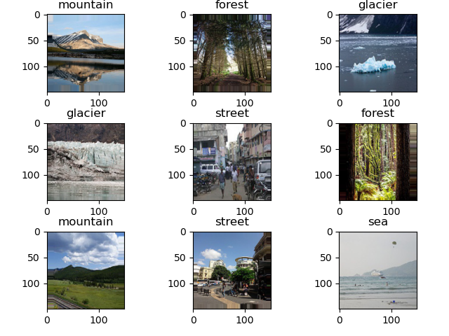

# ResNet50
### Dataset
The dataset used in this practice is intel-image-classification from kaggle at this [link](https://www.kaggle.com/puneet6060/intel-image-classification).
You can find the details about the details in the kaggle website. But give you a short note the size  of the images is (150, 150, 3).
To give you visual sample the images looks like as follow:

The network architecture used for this practice is ResNet50

### Short description of main components
- identity.py have function to implement identityBlock of ResNet
- convolutionalBlock.py have function to implement identityBlock of ResNet
- resNet.py have all the package neccesary, the first the function which build ResNet50 by concatinating the convolutionalBlock and identityBlock. Then the next step is to load the data and load it using ImageDataGenerator then you are good to go for train and evaluate the model.
